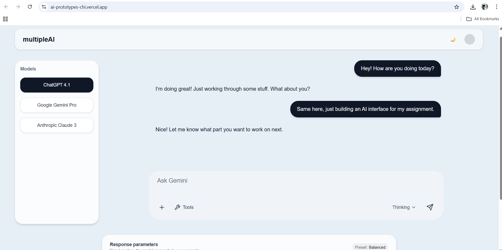

# MultipleAI — AI Model Switching Chat Interface

A frontend-only prototype built using **Next.js + TypeScript + TailwindCSS**, demonstrating a clean and modern interface for interacting with different AI models such as **ChatGPT, Gemini, and Claude**.  
The goal of this project is to research existing AI UIs, analyze features, design a polished interface in Figma, and implement the essential UI experience.

---

## 🔗 Live Demo
**Deployed Link (Vercel):** https://ai-prototypes-chi.vercel.app/ 
**GitHub Repository:** https://github.com/jaikritsinghfinito/ai-prototype

---

## 📘 Research

I reviewed 4–5 leading AI interfaces to understand UI patterns, core features, accessibility, and user experience:

| Platform | Key Features Found |
|----------|-------------------|
| **OpenAI ChatGPT** | Chat bubbles, model switcher, conversation history, prompt actions |
| **Gemini** | Floating input bar, tools menu, theme toggle, clean minimal layout |
| **Claude** | Transparent AI responses, flowing messages, lightweight typography |
| **HuggingFace Playground** | API model selection, parameters sliders |
| **Microsoft Copilot Lab** | Prompt templates, quick insert features |

### 🎯 Selected 6–8 Features for Prototype
- Model selector sidebar (ChatGPT / Gemini / Claude)
- Chat input bar similar to Gemini UI
- Transparent & floating chat bubbles for AI messages
- Light/Dark theme toggle (saved to localStorage)
- Scrollable chat history
- Mock API model list (`/api/models`)
- Parameter sliders panel (WIP for extension)

---

## 🎨 Design

### Figma Mockup
👉 https://www.figma.com/design/lVCjizj6sXfLxZMQWQ6hOJ/Untitled?node-id=0-1&t=R9tMbSAlrmwW0rGo-1

### Tailwind Design Token Mapping
| Figma Token | Tailwind Class |
|-------------|----------------|
| Main background | `bg-[#E6EEF6]` / `bg-[#050816]` |
| Rounded corners | `rounded-3xl` / `rounded-full` |
| Drop shadow | `shadow-md shadow-gray-200` |
| Heading text | `text-xl font-semibold` |

### Design Notes
The layout features a floating input bar with soft shadows and transparency, the model panel aligned to the left, and messages centered with subtle animation and spacing.

---

## 🧠 Development

### Tech Stack
- **Next.js 16** (App Router)
- **React**
- **TypeScript**
- **TailwindCSS**
- **Storybook** (component documentation)
- **Vercel deployment**

### Implementation Overview
- Components created: `Navbar`, `ModelSelector`, `ChatBubble`, `PromptInput`, `ParametersPanel`
- Mock API route: `GET /api/models` returns available model list
- Chat auto-scroll implemented using `useRef` + `scrollIntoView`
- Theme stored in `localStorage`
- Real-time updating chat messages using `useState`

### Known Limitations / Next Steps
- Storybook setup started, needs documentation for 4 core components
- Parameter sliders functional UI only (no actual model binding)
- No real AI API used; mock response simulates AI reply
- Authentication & data persistence not implemented yet

---

## 🧪 Running Locally

```bash
npm install
npm run dev


